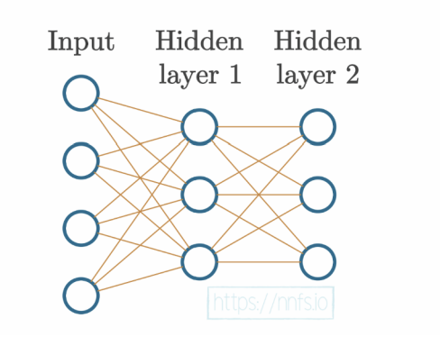

# Neural Network — From Single Neuron to Two Hidden Layers



---

## 1. Single Neuron (`single-neuron.py`)

A single neuron takes multiple inputs, multiplies each by a weight, sums them up, and adds a bias.

```python
inputs  = [1.0, 2.0, 3.0]
weights = [0.2, 0.4, 0.6]
bias    = 2.0

output = np.dot(inputs, weights) + bias
```

**Formula:** `output = (1.0×0.2) + (2.0×0.4) + (3.0×0.6) + 2.0 = 4.8`

| Input | Weight | Input × Weight |
|-------|--------|----------------|
| 1.0   | 0.2    | 0.2            |
| 2.0   | 0.4    | 0.8            |
| 3.0   | 0.6    | 1.8            |
| —     | bias   | + 2.0          |
| **Output** | | **4.8**   |

---

## 2. Three Neurons / One Layer (`three-neurons.py`)

A layer of 3 neurons, each with its own set of weights and a bias, all sharing the same 4 inputs.

```python
inputs  = [1.0, 2.0, 3.0, 2.5]
weights = [[0.2,  0.8,  -0.5,  1.0],   # neuron 1
           [0.5, -0.91,  0.26, -0.5],   # neuron 2
           [-0.26, -0.27, 0.17, 0.87]]  # neuron 3
biases  = [2.0, 3.0, 0.5]

layer_outputs = np.dot(weights, inputs) + biases
```

Each row in `weights` belongs to one neuron. `np.dot(weights, inputs)` computes all 3 neuron outputs at once, then the corresponding bias is added.

| Neuron | Weights                    | Bias | Output |
|--------|----------------------------|------|--------|
| 1      | [0.2, 0.8, -0.5, 1.0]     | 2.0  | 4.8    |
| 2      | [0.5, -0.91, 0.26, -0.5]  | 3.0  | 1.21   |
| 3      | [-0.26, -0.27, 0.17, 0.87]| 0.5  | 2.385  |

---

## 3. Two Hidden Layers (`two-hidden-layers.py`)

The diagram shows a fully connected (dense) neural network with:
- **Input layer** — 4 neurons, one per feature
- **Hidden Layer 1** — 3 neurons
- **Hidden Layer 2** — 3 neurons

Every neuron in each layer is connected to every neuron in the next layer (orange lines).

```python
inputs = [[1, 2, 3, 2.5], [2., 5., -1., 2], [-1.5, 2.7, 3.3, -0.8]]
```

This is a **batch of 3 samples**, each with **4 features**:

| Sample | Feature 1 | Feature 2 | Feature 3 | Feature 4 |
|--------|-----------|-----------|-----------|-----------|
| 1      | 1.0       | 2.0       | 3.0       | 2.5       |
| 2      | 2.0       | 5.0       | -1.0      | 2.0       |
| 3      | -1.5      | 2.7       | 3.3       | -0.8      |

The 4 values in each sample map to the 4 input neurons. The 3 rows represent 3 samples processed as a batch — the diagram reflects the structure for a single sample.

---

## Key Concepts

| Concept | Description |
|---------|-------------|
| **Input** | Raw feature values fed into the network |
| **Weight** | Learnable multiplier for each input connection |
| **Bias** | Learnable offset added after the weighted sum |
| **`np.dot`** | Efficiently computes weighted sums across all neurons |
| **Batch** | Multiple samples processed together in one forward pass |

---

## Manim Animations

Step-by-step animated explainers for each concept, built with [Manim](https://www.manim.community/). Designed to be beginner-friendly (class 9 level).

### Installation

**Prerequisites (macOS):**

```bash
brew install py-cairo ffmpeg
pip install manim
```

**Verify:**

```bash
manim --version
```

> If you get a LaTeX error, install missing packages:
> ```bash
> sudo mktexlsr
> sudo tlmgr install standalone preview
> ```

---

### Running an Animation

```bash
manim -pql <filename>.py <ClassName>
```

| Flag | Meaning |
|------|---------|
| `-p` | Auto-play video when done |
| `-ql` | Low quality (fast) — use `-qm` or `-qh` for better quality |

Output is saved to `media/videos/<filename>/480p15/<ClassName>.mp4`

---

### Animation Files

#### `three_neurons_anim.py` — Three Neuron Layer

```bash
manim -pql three_neurons_anim.py ThreeNeurons
```

Animates the forward pass through a single layer of 3 neurons:
- 4 input nodes with values
- Weighted connections (green = positive, red = negative)
- Bias labels per neuron
- Computed output values
- Formula: output = W · x + b

---

#### `two_hidden_layers_anim.py` — Two Hidden Layers

```bash
manim -pql two_hidden_layers_anim.py TwoHiddenLayers
```

Animates a full two-layer forward pass using sample `[1, 2, 3, 2.5]`:
- Input → Layer 1 connections with weight labels
- Layer 1 intermediate outputs
- Layer 1 → Layer 2 connections with weight labels
- Final output values
- Formula: o = W₂ · (W₁ · x + b₁) + b₂

---

#### `softmax_anim.py` — Softmax Function

```bash
manim -pql softmax_anim.py SoftmaxExplained
```

Explains Softmax using a Cat / Dog / Bird classifier:

| Scene | Content |
|-------|---------|
| 1 | Raw scores bar chart — shows they don't sum to 100% |
| 2 | Step 1: Apply eˣ to each score |
| 3 | Step 2: Divide by sum → probabilities |
| 4 | Final % bars with winner highlighted |
| 5 | Formula + 4 key takeaways |

Formula: `Softmax(xᵢ) = eˣⁱ / Σ eˣʲ`

---

#### `relu_anim.py` — ReLU Activation Function

```bash
manim -pql relu_anim.py ReLUExplained
```

| Scene | Content |
|-------|---------|
| 1 | Water tap analogy |
| 2 | Piecewise formula |
| 3 | Animated graph (flat for negatives, diagonal for positives) |
| 4 | 5 example values computed step by step |
| 5 | Before / After bar chart with Transform animation |
| 6 | Why we use ReLU in deep learning |

Formula: `ReLU(x) = max(0, x)`

---

#### `sigmoid_anim.py` — Sigmoid Function

```bash
manim -pql sigmoid_anim.py SigmoidExplained
```

| Scene | Content |
|-------|---------|
| 1 | Dimmer switch analogy |
| 2 | Formula breakdown |
| 3 | S-curve graph with reference lines at 0, 0.5, 1 |
| 4 | 5 values computed with % output |
| 5 | Output bar chart |
| 6 | Sigmoid vs Softmax comparison table |

Formula: `σ(x) = 1 / (1 + e⁻ˣ)`

---

#### `cross_entropy_anim.py` — Cross-Entropy Loss

```bash
manim -pql cross_entropy_anim.py CrossEntropyExplained
```

| Scene | Content |
|-------|---------|
| 1 | Teacher grading analogy |
| 2 | One-hot encoding explained |
| 3 | The −log(p) curve — why it punishes wrong predictions |
| 4 | Formula with legend |
| 5 | Good prediction → low loss (0.357) |
| 6 | Bad prediction → high loss (2.303) |
| 7 | Side-by-side comparison |

Formula: `L = −Σ yᵢ · log(ŷᵢ)`

---

### Planned Videos

| # | Topic | File |
|---|-------|------|
| 1 | Single neuron forward pass | coming soon |
| 2 | Three neuron layer | `three_neurons_anim.py` |
| 3 | Two hidden layers | `two_hidden_layers_anim.py` |
| 4 | Softmax | `softmax_anim.py` |
| 5 | ReLU | `relu_anim.py` |
| 6 | Sigmoid | `sigmoid_anim.py` |
| 7 | Cross-Entropy Loss | `cross_entropy_anim.py` |
| 8 | Backpropagation | coming soon |
